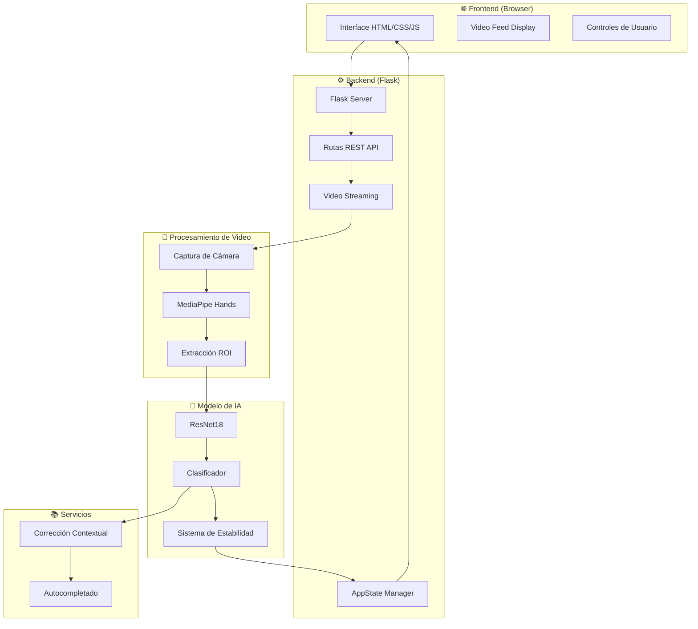

# Arquitectura del Sistema

## 📋 Resumen

El **Traductor de Lenguaje de Señas** es una aplicación web que utiliza visión por computadora y aprendizaje profundo para reconocer en tiempo real las letras del alfabeto en lenguaje de señas colombiano (LSC).

## 🏗️ Arquitectura General



## 🔄 Flujo de Datos

### 1. Captura de Video

```python
CameraStream (Hilo independiente)
├── Inicialización con DirectShow (Windows)
├── Configuración: 640x480, Buffer=1
├── Lectura continua en background thread
└── Frame disponible para procesamiento
```

**Características:**
- Thread independiente para evitar lag
- Buffer mínimo (1 frame) para reducir latencia
- Espejo automático para webcam

### 2. Detección de Manos (MediaPipe)

```
Frame de video
    ↓
MediaPipe Hands
    ├── Detecta presencia de mano
    ├── Extrae 21 landmarks
    └── Calcula bounding box
        ↓
ROI (Region of Interest)
    └── Frame[y_min:y_max, x_min:x_max] + margen
```

**Parámetros:**
- `max_num_hands`: 1
- `min_detection_confidence`: 0.5
- Margen adicional: 40px

### 3. Clasificación con ResNet18

```
ROI (imagen de mano)
    ↓
Preprocesamiento
    ├── Resize a 224x224
    ├── Normalización ImageNet
    └── Conversión a tensor
        ↓
ResNet18 Fine-tuned
    ├── Feature extraction
    ├── Fully connected layer (22 clases)
    └── Softmax → Probabilidades
        ↓
Top-3 Predicciones
    └── [(Letra1, conf1), (Letra2, conf2), (Letra3, conf3)]
```

### 4. Sistema de Estabilidad Temporal

El sistema requiere **consistencia temporal** para confirmar una letra:

```python
Predicción actual == Predicción anterior?
    SÍ → frames_consecutivos++
        ↓
    frames_consecutivos >= 8 AND tiempo >= 2.5s?
        SÍ → ✅ CONFIRMAR LETRA
        NO → Seguir acumulando
    
    NO → Resetear contador
        └── Nueva predicción candidata
```

**Parámetros configurables:**
- `CONF_THRESHOLD`: 0.80 (80% confianza mínima)
- `STABLE_TIME`: 2.5 segundos
- `FRAMES_CONSISTENTES`: 8 frames

### 5. Corrección Contextual

Sistema inteligente que usa el diccionario para corregir errores:

```python
Predicción = "X" (90% confianza)
Palabra actual = "HOL"
    ↓
¿"HOLX" existe en diccionario? → NO
    ↓
Revisar alternativas (Top-3):
    "A" (75% confianza) → ¿"HOLA" existe? → SÍ ✅
    ↓
Corrección: X → A
```

### 6. Autocompletado Automático

```python
Palabra detectada: "GRA"
    ↓
Sugerencias del diccionario:
    ["GRACIAS", "GRANDE", "GRATO"]
    ↓
¿Solo una sugerencia? → SÍ
    ↓
Autocompletar: "GRA" → "GRACIAS"
    └── Finalizar palabra automáticamente
```

## 🧩 Componentes Principales

### Backend (Flask)

#### `app.py` - Servidor Principal

**Rutas REST:**
- `GET /` - Página principal
- `GET /video_feed` - Stream MJPEG de video
- `GET /get_estado` - Estado actual (JSON)
- `POST /finalizar_palabra` - Guardar palabra
- `POST /limpiar` - Resetear todo
- `POST /completar_palabra` - Autocompletar
- `POST /borrar_frase` - Eliminar frase
- `POST /hablar_frase` - Text-to-Speech

**Clases principales:**

```python
class AppState:
    """Gestiona el estado de la aplicación"""
    - letras_detectadas: Lista de letras confirmadas
    - palabras: Lista de palabras formadas
    - ultima_prediccion: Cache de predicción
    - tiempo_inicio_pred: Timer para estabilidad
    - frames_misma_letra: Contador de frames
    
class CameraStream:
    """Captura de video en thread separado"""
    - stream: VideoCapture
    - update(): Loop continuo de lectura
    - read(): Obtener frame actual

class AutocompleteService:
    """Servicio de autocompletado"""
    - get_suggestions(prefix): Top 5 sugerencias
    - is_valid_prefix(prefix): Validar prefijo
```

### Frontend (HTML/CSS/JavaScript)

#### Estructura de la Interfaz

```html
<div class="container">
    ├── Video Feed (MJPEG Stream)
    ├── Letra Actual (+ Barra de estabilidad)
    ├── Palabra en Construcción
    ├── Sugerencias de Autocompletado
    ├── Frase Completa
    └── Controles (Finalizar, Limpiar, Hablar)
</div>
```

#### Actualización en Tiempo Real

```javascript
// Polling cada 100ms
setInterval(() => {
    fetch('/get_estado')
        .then(response => response.json())
        .then(data => {
            updateLetra(data.letra, data.confianza)
            updatePalabra(data.palabra_actual)
            updateSugerencias(data.sugerencias)
            updateFrase(data.frase)
            updateStabilityBar(data.tiempo_restante)
        })
}, 100)
```

## ⚙️ Configuración y Parámetros

### Parámetros del Modelo

| Parámetro    | Valor                                          | Descripción             |
| ------------ | ---------------------------------------------- | ----------------------- |
| `MODEL_PATH` | `modelos_abecedario/mejor_modelo_resnet18.pth` | Ruta al modelo          |
| `DEVICE`     | `cuda` / `cpu`                                 | Dispositivo de cómputo  |
| `CLASSES`    | 22 letras                                      | A-Z (sin G, J, Ñ, S, Z) |

### Parámetros de Estabilidad

| Parámetro             | Valor | Descripción              |
| --------------------- | ----- | ------------------------ |
| `CONF_THRESHOLD`      | 0.80  | Confianza mínima (80%)   |
| `STABLE_TIME`         | 2.5s  | Tiempo de confirmación   |
| `FRAMES_CONSISTENTES` | 8     | Frames consecutivos      |
| `NO_HAND_TIMEOUT`     | 3.5s  | Guardar palabra sin mano |
| `CLEAR_TIMEOUT`       | 10s   | Limpiar tras inactividad |

### Optimizaciones

1. **Threading:** Captura de video en hilo separado
2. **Buffer mínimo:** Reduce latencia de video
3. **Resize:** Frames a 800px max para mejor rendimiento
4. **GPU:** Soporte CUDA si está disponible
5. **Predicción Top-K:** Solo top-3 para reducir cómputo

## 🔐 Gestión de Estado

```python
AppState mantiene:
├── Estado de detección inmediato
│   ├── current_letra
│   ├── current_conf
│   └── hand_detected
├── Estado de acumulación
│   ├── letras_detectadas (palabra actual)
│   └── palabras (frase completa)
└── Estado temporal
    ├── ultima_prediccion
    ├── tiempo_inicio_pred
    ├── frames_misma_letra
    └── timers (última mano, última letra)
```

## 📊 Métricas de Rendimiento

- **Latencia de video:** ~30-60ms (thread dedicado)
- **Inferencia del modelo:** ~20-50ms (CPU), ~5-10ms (GPU)
- **Actualización UI:** 100ms (polling)
- **Tiempo total de respuesta:** <200ms

## 🔮 Tecnologías Clave

| Tecnología    | Versión             | Propósito              |
| ------------- | ------------------- | ---------------------- |
| **Flask**     | 3.x                 | Framework web          |
| **PyTorch**   | 2.x                 | Deep Learning          |
| **OpenCV**    | 4.x                 | Procesamiento de video |
| **MediaPipe** | 0.10.x              | Detección de manos     |
| **ResNet18**  | ImageNet pretrained | Clasificación          |

## 📈 Escalabilidad y Mejoras Futuras

### Optimizaciones Posibles
- ✨ Implementar WebSockets en lugar de polling
- ✨ Usar TensorRT para acelerar inferencia
- ✨ Implementar modelo más ligero (MobileNet)
- ✨ Caching de predicciones similares
- ✨ Quantización del modelo

### Funcionalidades Futuras
- 🚀 Reconocimiento de señas dinámicas (movimiento)
- 🚀 Soporte para más idiomas de señas
- 🚀 Modo offline con caché de modelo
- 🚀 API REST para integración con otras apps
- 🚀 Aplicación móvil nativa

---

**Nota:** Esta arquitectura está diseñada para ser educativa y accesible, priorizando la claridad del código sobre optimizaciones extremas.
